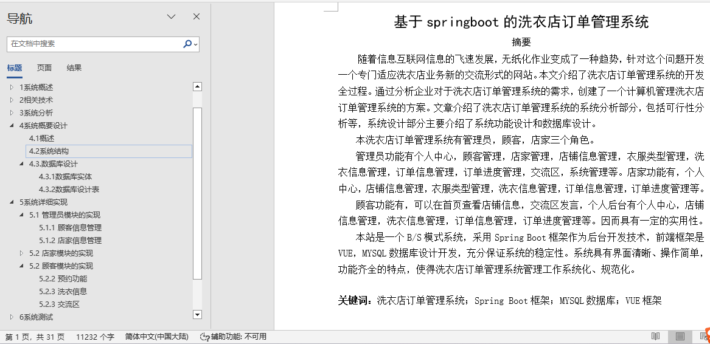
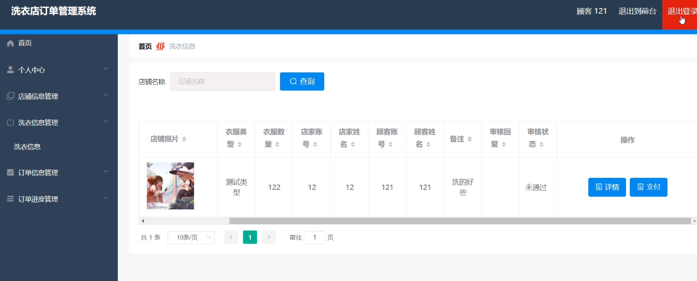
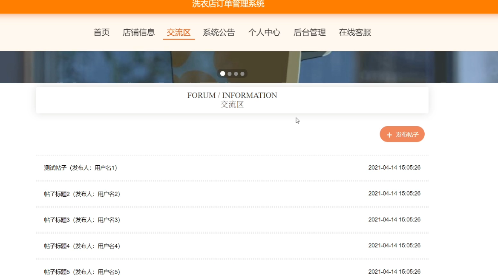
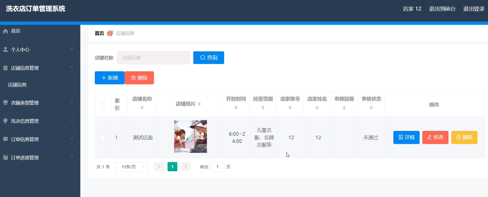
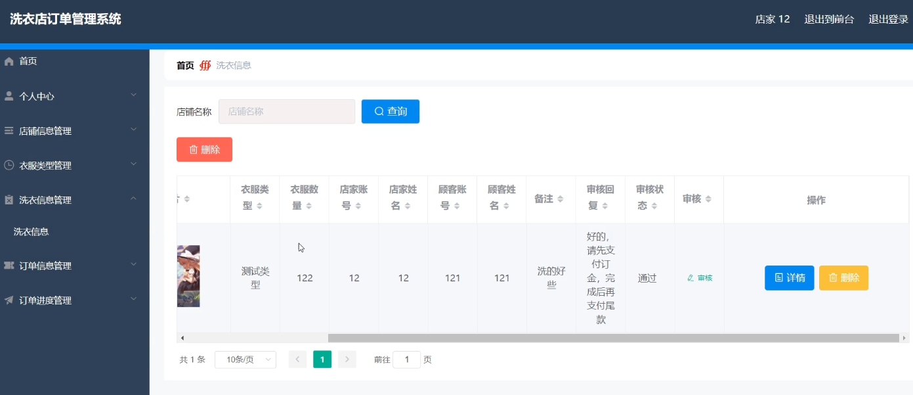
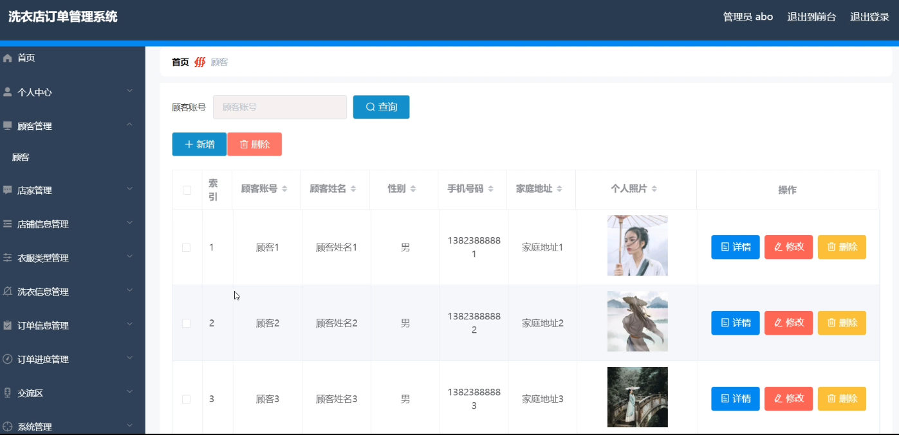
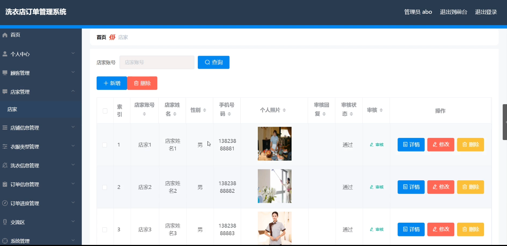

## 洗衣店订单管理系统(程序+报告)

###  获取sql数据库文件: 从戎源码网 (https://armycodes.com/) QQ: 386869957 QQ群: 377586148
###  所有系统地址: (https://github.com/YuLin-Coder/AllProjectCatalog) 
###  所有项目以及源代码本人均调试运行无问题 可支持远程安装部署调试、定制修改、代码讲解

## 项目介绍
洗衣店订单管理系统，系统包含两种角色：用户、管理员，系统分为前台和后台两大模块，主要功能如下：

1管理员模块的实现
- 顾客信息管理: 管理顾客信息，包括添加、修改、删除和查询操作。
- 店家信息管理: 管理店家信息，包括添加、修改、删除和查询操作。

2店家模块的实现
- 店铺信息管理: 店家可以对店铺信息进行添加、修改和删除操作。
- 洗衣信息管理: 店家可以查询和审核洗衣信息。

3顾客模块的实现
- 预约功能: 顾客可以在店铺信息页面进行预约操作。
- 洗衣信息: 顾客可以在后台查看自己的洗衣信息。
- 交流区: 顾客可以在交流区发布信息和交流。

## 项目技术
- 编程语言：Java
- 数据库：MySQL
- 项目管理工具：Maven
- 前端技术：HTML、CSS、JavaScript、Vue
- 后端技术：Spring、SpringMVC、MyBatis

## 运行环境
- JDK版本：JDK1.8及以上
- 开发工具：IDEA、Ecplise、Myecplise都可以
- 数据库: MySQL5.7及以上
- Maven：maven3.0及以上
- Node：14.14.0及以上

## 运行截图

